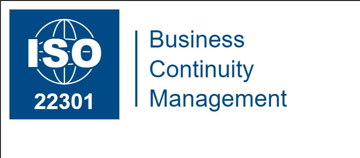

<div align="center">

<!-- ═══════════════════════════ LOGO ROW ═══════════════════════════ -->
<table border="0" cellspacing="0" cellpadding="0">
  <tr>
    <td align="center" width="400">
      <!-- Replace src with your first partner/framework logo -->
      <br/>
      <sub><b>ISO 22301</b></sub>
    </td>
    <td align="center" width="400">
      <!-- ── CENTER: New Nile Bank ── -->
      <br/>
      <sup><i>Konekt</i></sup>
    </td>
    <td align="center" width="400">
      <!-- Replace src with your second partner/framework logo -->
      <br/>
      <sub><b>NTRA</b></sub>
    </td>
  </tr>
</table>

<br/>


#  Konekt Telcom — BC/DR/IR Programme

### Business Continuity · Disaster Recovery · Incident Response

**A complete, professional-grade BC/DR/IR programme built for an Egyptian telecommunications company,  
aligned to ISO/IEC 27001:2022, ISO 22301:2019, and the Telecom Regulatory Authority (TRA) of Egypt.**

---


</div>

---

## 📌 Project Overview

This repository contains the complete **BC/DR/IR (Business Continuity, Disaster Recovery & Incident Response)** programme for **Konekt Telcom** — a fictional Egyptian telecommunications company used as a realistic case study.

The programme covers every layer of organisational resilience — from governance and risk identification, through live incident response playbooks and disaster recovery procedures, to post-incident review and staff training. It is designed to demonstrate what a **real, audit-ready, regulator-compliant** BC/DR/IR programme looks like in the telecom sector.

> **CISO & Programme Owner:** Samara Risha  
> **Effective Date:** 16/04/2026  
> **Regulatory Framework:** TRA Egypt · ISO/IEC 27001:2022 · ISO 22301:2019 · NIST SP 800-61

---

## 📁 Repository Structure

```
Konekt-BCDR-IR-Programme/
│
├── Governance-and-Foundation/
│   ├── 00-KNKT-CompanyOverview.pdf
│   ├── 01-KNKT-Scope.pdf
│   └── 02-KNKT-Stakeholders.pdf
│
├── Risk-Management-and-BIA/
│   ├── 04-KNKT-AssetInventory.pdf
│   ├── 05-KNKT-RiskAssessment.docx
│   └── 06-KNKT-Business-Impact-Analysis.pdf
│
├── Business-Continuity-and-Crisis/
│   ├── 07-KNKT-CrisisComms.pdf
│   ├── 08-KNKT-EmergencyContacts.pdf
│   ├── 09-KNKT-BCP-Network.pdf
│   └── 10-KNKT-BCP-Cyber.pdf
│
├── Disaster-Recovery-and-Testing/
│   └── 12-KNKT-DRTestPlan.pdf
│
├── Training-and-Awareness/
│   └── 15-KNKT-TrainingPlan.pdf
│
└── Logos/
    ├── Logo-Konekt.png
    ├── NTRA.jpg
    └── image.png
```

---

## 📄 Document Index

### 🏛️ Governance & Foundation

| # | Document | Description |
|---|----------|-------------|
| 00 | **Company Overview** | Organisational profile, services portfolio, technology infrastructure, BC/DR programme context |
| 01 | **ISMS Scope** | Defines the boundaries of the ISMS — locations, departments, assets, exclusions, ISO 27001 coverage |
| 02 | **Stakeholder Register** | All internal and external interested parties, their requirements, impact levels, and engagement frequency |

---

### ⚠️ Risk Management & BIA

| # | Document | Description |
|---|----------|-------------|
| 04 | **Asset Inventory** | Complete register of all in-scope assets — network hardware, servers, applications, databases, personnel |
| 05 | **Risk Assessment** | Threat identification, likelihood and impact scoring, risk treatment decisions |
| 06 | **Business Impact Analysis (BIA)** | RTO, RPO, MTD per business function · Financial impact per hour · Recovery priority classification |

---

### 🚨 Business Continuity & Crisis Response

| # | Document | Description |
|---|----------|-------------|
| 07 | **Crisis Communication Plan** | Stakeholder communication matrix, message templates, regulatory notification procedures, Dos & Don'ts |
| 08 | **Emergency Contact & Notification Tree** | Tiered escalation tree — T1 Executive through T4 External — with contact directory and notification rules |
| 09 | **BCP — Core Network Operations** | Step-by-step recovery procedures for IP/MPLS backbone and BGP routing infrastructure |
| 10 | **BCP — Cybersecurity Incident Response** | Ransomware, DDoS, data breach, insider threat playbooks — Identification through Post-Incident Review |

---

### 🔄 Disaster Recovery & Testing

| # | Document | Description |
|---|----------|-------------|
| 12 | **DR Test Plan & Results Register** | Testing types, scenario catalogue, scheduling, RTO/RPO validation methodology and results register |

---

### 🎓 Training & Awareness

| # | Document | Description |
|---|----------|-------------|
| 15 | **Information Security Awareness & Training Plan** | ISO 27001 Cl.7.2 compliant training programme — modules, audiences, KPIs, delivery schedule |

---

## 🔑 Key Metrics

| Metric | Value |
|--------|-------|
| Critical Service RTO | ≤ 1–2 hours (Core Network, Mobile, Enterprise) |
| Critical Service RPO | ≤ 15–30 minutes |
| Maximum Tolerable Downtime (MTD) | ≤ 4 hours for P1 functions |
| Financial Exposure (P1 outage) | EGP 470,000+/hour combined |
| TRA Regulatory Notification Window | ≤ 4 hours from detection |
| ISO 27001 Controls Covered | 93/93 Annex A controls (73 Full · 16 Partial · 4 Planned) |
| BC/DR Testing Frequency | Biannual full failover + Annual tabletop |

---

## 🏗️ Programme Architecture

```
DETECT  ──►  CLASSIFY  ──►  CONTAIN  ──►  RECOVER  ──►  REVIEW
  │               │               │              │            │
SIEM/NOC       BIA 06         BCP 09/10      DR Test 12    PIR 13
Asset Inv.04   Risk Reg.05    Crisis 07      BCP-BILL 11   SoA 14
               Scope 01       Contacts 08    BIA Priority  Training 15
```

---

## 🌍 Regulatory Alignment

| Regulation / Standard | Coverage |
|-----------------------|----------|
| **ISO/IEC 27001:2022** | Full ISMS — 93 Annex A controls documented in SoA |
| **ISO 22301:2019** | Business Continuity Management System framework |
| **NIST SP 800-61 Rev. 2** | Incident Response lifecycle (Preparation → Detection → Containment → Recovery → Lessons Learned) |
| **TRA Egypt** | Mandatory incident notification, service availability SLAs, regulatory reporting |
| **Egypt Data Protection Law (151/2020)** | PII handling, breach notification obligations |

---

## 📖 Use Case — Operation Blackout

This programme was stress-tested against a full **Use Case document (UC-KNKT-BCDR-IR-001)** simulating a real-world scenario:

> *At 02:47 AM, a coordinated ransomware attack encrypts the primary data centre and simultaneously drops all BGP sessions — taking 2.3 million subscribers offline. Financial exposure: EGP 470,000+/hour.*

The use case traces every activation across all 15 documents — from the first SIEM alert to the TRA closure report — and delivers a 9-criterion programme assessment showing what worked, what missed, and how the corrective actions make the programme stronger.

---

## 👤 About This Project

This programme was developed as part of a **Risk Management project** in the **Telecommunications industry**, focusing on building a complete, realistic, and audit-ready BC/DR/IR framework from scratch.

> *"Resilience isn't about preventing every incident. It's about ensuring that when the worst happens, your organisation has the clarity, the tools, and the trained people to respond with precision — and emerge with its customers' trust intact."*
> — Samara Risha, CISO, Konekt Telcom

---

<div align="center">

**Built with** ❤️ **for the GRC & InfoSec community**


</div>
